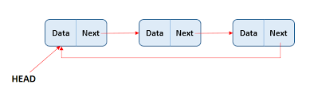

### [<- Home](welcome.md)

# Linked List

## Introduction

Linked lists are another very useful data structure. In Python, arrays are called "lists", so you'd think linked lists would be very similar since they're both "lists". This is incorrect because the only applicable similarity between a Python "list" (array) and a linked list is the ability to store data in memory. A fundamental principle of arrays is that they are contiguous in memory. This is not the case with linked lists.

Each element in the linked list can be located anywhere in memory. So each item has a "direction" to the next item in the list. These instructions are contained within each "link" called a node. A node consists of two parts, stored data and a memory address book containing the address of the previous node and the address of the next node.

The nature of linked lists makes it impossible to jump directly to an item in the list. One has to either start from the beginning, called the head, or the end of the list, and walk through each "link" until the desired data is found. Because of this, looking up a value in a linked list is O(n).



## Why we can use?

- The linked list's chain system allows you to quickly add and remove items. Unlike arrays or lists, this also doesn't require any reorganization of the data structure.
- Linear data structures are usually easier to implement with linked lists.
- Linked lists also do not require a fixed or initial size due to their chain-like structure.

## Common Operations

Operation         | Python Code              | How does it work?                  | Efficiency
------------------|--------------------------|------------------------------------|-----------
insert_head(value)|my_deque.appendleft(value)| Adds value before the current head | O(1)
insert_tail(value)|my_deque.append(value)    | Adds value after current tail      | O(1)
insert(i, value)  |my_deque.insert(i, value) | Adds value after the i node        | O(n)
remove_head()     |value = my_deque.popleft()| Removes current head value         | O(1)
remove_tail(index)|value = my_deque.pop()    | Removes the current tail value     | O(1)
remove(i)         |del my_deque[i]           | Removes the i node                 | O(n)
size()            |length = len(my_deque)    | Returns the size of the linked list| O(1)
empty()           |if len(my_deque) == 0:    | Returns true if the list is empty  | O(1)

## Example of Linked List

In the example below this is how you could search for a given value in the linked list. If the the value is not in the list or its the last item it will take longer.

``` python

def finding_values(self, value):
    # This sets the current node as the tail of the list
    current_node = self.tail
    # This loops until the current node is equal to the value
    while current != value:
        # You can then do any action through each loop
        print(current.data)
        # This will set the current node as the node 
        # previous to the node you were at previously
        current = current.previous

```

## Problem to Solve

Now here is a problem where you should complete the function to insert and remove a value at the head of the list:

[Linked List](linked_list.py)

Solution:

[Linked List Solution](linked_list_solution.py)