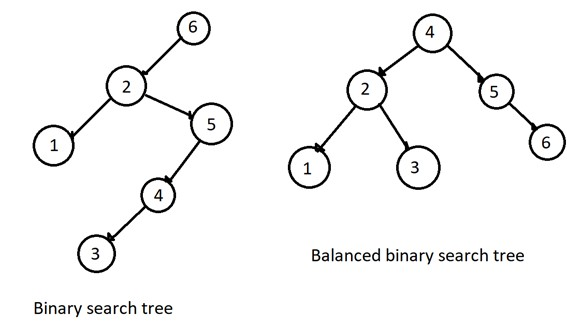

### [<- Home](welcome.md)

# Trees

## Introduction

In computer science, a binary tree is a tree data structure in which each node has at most two children, which are referred to as the left child and the right child.

The root node is the top most node of your binary tree there can only be one root node per tree.

At the very bottom of your tree you have your leaf nodes. These are your bottom most nodes, you can have more than one leaf. These can be called the leaves of your binary tree.

A Subtree is a smaller section of a binary tree. In your original tree pick a new node to be your root node for this binary subtree.

## Key Terms

*Root* - The root of a binary tree is at the top and there is only one.

*Parent* - The parent of a node is one level above of a node.

*Child* - The children of a node are the nodes a level below the node.

*Leaf* - The leaves of a binary tree are the nodes with no children.

Here we can see a diagram of a binary tree:


## BST

A binary search tree (BST) is a binary tree that follows the rules for data placed into the tree. Data is placed into the BST by comparing data with the value in the parent node.

If the data is less than the parent node, it goes into the left subtree. If the data is greater than the parent node, it goes into the right subtree.

If duplicates are allowed, they can go in the left or right of the root.

A balanced binary search tree is a BST where the height between any two subtrees is evenly distributed. The height of a tree can be found by counting the max number of nodes between the root and leaves.



## Time Complexity of Binary Search Tree

Operation | Description | Time Complexity
-------- | -------- | --------
Insert(value) | Insert value into a tree | O(log n)
Remove(value) | Remove value from the tree | O(log n)
Contains(value) | Determine if value exists | O(log n)
traverse_forward() | Go all objects from smallest to largest | O(n)
traverse_reverse() | Go all objects from largest to smallest | O(n)
height(node) | Determine if the height of a node | O(n)
Size() | Return the size of the BST | O(1)
Empty() | Returns true if the root node is empty | O(1)

### Example of binary tree

``` python
# This is the node class
class Node:

    def __init__(self, data):
        # This is the left child
        self.left = None
        # This is the right child
        self.right = None
        # This is the node's value
        self.data = data

    # This is the print function
    def PrintTree(self):
        print(self.data)

root = Node(24) # The output will give us 24

root.PrintTree()

```

## Problem to Solve

Now here is a problem where you can sort a binary tree:

[Binary](tree.py)

Solution:

[Binary Solution](tree_solution.py)